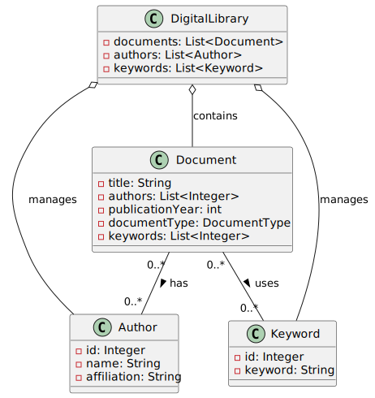
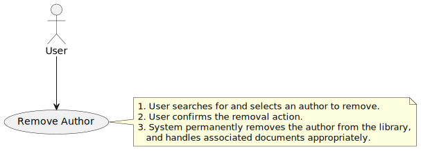
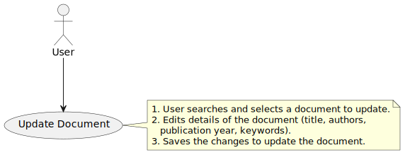
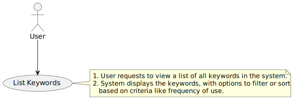

# Digital Library

This project documents the architecture and use cases of a digital library system. Below are the domain models, object models, state diagrams, and use cases encompassing various functionalities within the system.

## Domain Model

### Class Diagram

### Object Diagram

### State Diagram

## Use Cases

### General Use Case Diagram

### Use Cases for Author

- **Add Author**

  

- **Edit Author**

  

- **List Authors**

  

- **Remove Author**

  

### Use Cases for Document

- **Create Document**

  

- **Delete Document**

  

- **Read Document**

  

- **Update Document**

  

- **Classify Documents**

  

- **Search Documents**

  

### Use Cases for Keywords

- **Add Keyword**

  

- **Edit Keyword**

  

- **List Keywords**

  

- **Remove Keyword**

  
