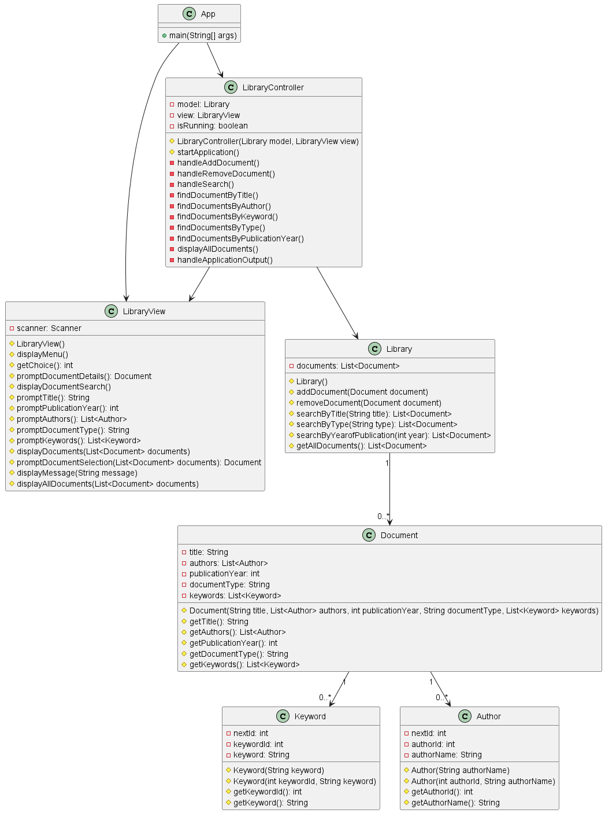

# Biblioteca - Veronika Esparragoza

Los cambios mas importantes fueron:
- Mejorar la estructura y diseño del sistema
- Arreglar la cohesion y acoplamiento de las clases
- Se eliminaron las clases Articulo, Libro, Paper y Revista, y se reemplazaron por la clase Documento
- La clase "ManagementSystem" se dividió en Library, LibraryController y LibraryView

## Diagrama de clases
