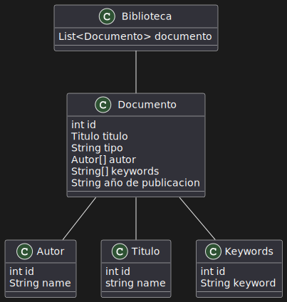
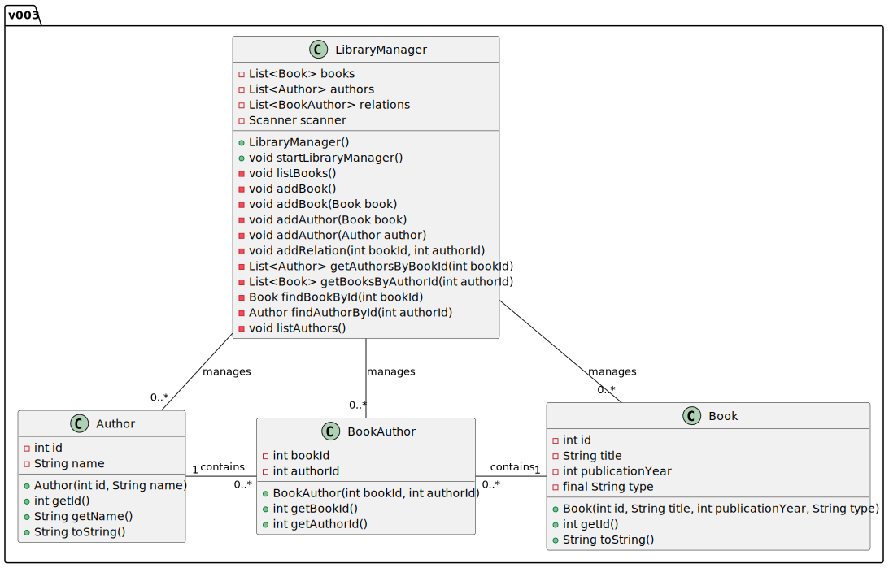

## Proyecto Parcial

### Introducción

Este repositorio es el resultado de la fusión de dos proyectos previos: mi modelo inicial y el modelo establecido en clase por el profesor Masías. El propósito principal de esta combinación es crear una versión mejorada y simplificada que integre lo mejor de ambos enfoques.

### Modelo Inicial

Descripción: Representación visual del modelo inicial desarrollado para este proyecto.

### Modelo Establecido en Clase

Descripción: Representación visual del modelo establecido en clase por el profesor Masías.

## Porposito del proyecto
Mi proposito con este proyecto es combinar los dos proyectos para crear una versión más limpia, sencilla y mejorada y así quedaría el modelo final...

### Modelo Final

Se puede visualizar ejecutar a [aqui](App.java)